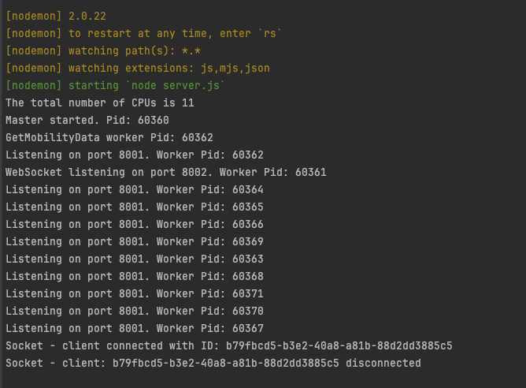

# Node cluster implementation using cluster.fork() + websocket(broadcast, jwt and host check)

## Getting started

---

## 1)Install Node.js (last stable version) https://nodejs.org/en/

---

## 2)To start locally:

- open terminal;
- execute command: `npm install` (need to be executed once after project clone - to install packages);
- execute command: `npm run local`
- execute command: `npm run prod`
---

## 3).env

- PORT - indicates port on which will work server

## 4) Prettier 
- execute command: ```npx prettier --write "**/*.js"```
- or 
- execute command: ```npx prettier --list-different "**/*.js"```


